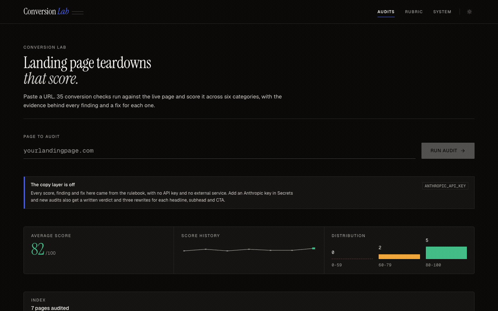

# Conversion Lab

**Paste a landing page URL. Get a scored teardown, ranked findings with fixes, and stronger copy.**

A CRO audit tool that fetches any public landing page, reads its copy and structure, and scores it 0-100 across six conversion categories. Every finding comes with the evidence it was based on, why it costs money, and what to do about it.

Runs with **zero configuration**. No API key, no database, no signup. Clone it, `npm run dev`, and you land in a populated app.

**Live demo: [theconversionlab.vercel.app](https://theconversionlab.vercel.app)**



*Recorded against the running app. The audit in the clip is a real fetch and a real score, not a mockup.*

---

## What is in the box

| Screen | What it does |
|---|---|
| `/` | Dashboard: run an audit, score history, distribution, all past audits |
| `/audit/:id` | Full report: calibrated score gauge, six category breakdowns, numbered findings, page vitals |
| `/audit/:id` → Rewrites | Three copy variants per slot, each with its angle and rationale |
| `/audit/:id` → What we read | Every fact the score was built from, so the grade is auditable |
| `/r/:token` | Public share link. Clean document view, no app chrome, no auth |
| `/rubric` | Live weight editor. Change it and every stored audit re-scores instantly |
| `/system` | Design system docs: tokens, primitives, charts, and the rules behind them |

---

## Two layers, and only one of them needs a key

**The rulebook** is 35 deterministic checks written in plain TypeScript. It fetches the page, parses the HTML, and measures real things: heading structure, CTA wording and placement, form length, proof signals, risk reversal, readability, reader-focus ratio, page weight, alt text, script count. No model involved, no key required, no data leaves your server beyond the page fetch itself.

**The copy layer** is optional. Add an Anthropic API key and new audits also get a written verdict on what the page is actually selling, plus three rewrites for each headline, subhead and CTA. Without a key the app says so plainly and the rulebook stands on its own.

This split is deliberate. A template that only works once billing is wired up is a template nobody remixes.

---

## Run it

```bash
npm install
npm run dev          # http://localhost:5000
```

That is the whole setup. The app boots with six real sample audits so nothing is an empty state.

### Optional: turn on the copy layer

Add to Secrets (Replit) or a local `.env`:

```
ANTHROPIC_API_KEY=sk-ant-...
```

Then re-run any audit. Optional tuning:

| Variable | Default | Notes |
|---|---|---|
| `ANTHROPIC_API_KEY` | unset | Enables verdict + rewrites |
| `CL_MODEL` | `claude-opus-5` | Any current Claude model id |
| `CL_EFFORT` | `medium` | `low` / `medium` / `high` / `xhigh` / `max` |
| `DATABASE_URL` | unset | Switches storage from memory to Postgres |
| `PORT` | `5000` | Replit maps this to 80 on publish |

### Optional: persist to Postgres

```bash
# Provision a database, then:
npm run db:push
```

Set `DATABASE_URL` and restart. Schema is pushed by Drizzle, sample audits are written once on first run, and the app behaves identically either way. If the connection fails the app falls back to memory rather than showing a blank screen.

---

## Remixing it

The whole point. Three surfaces, in order of effort:

### 1. Reweight the rubric (no code)

Open `/rubric`, drag the sliders, save. Every stored audit re-scores from its existing findings, so comparisons stay valid without re-fetching anything.

Starting points worth trying:

- **Ecommerce** - raise Proof, add a shipping-and-returns check
- **B2B SaaS** - raise Clarity, add a pricing-transparency rule
- **Lead gen** - raise Friction, penalise every form field past the third
- **Publishers** - drop Offer to zero, weight Craft higher

### 2. Change the checks (`server/analyzer/rules.ts`)

Each rule is about fifteen lines and owns exactly one category:

```ts
{
  id: "risk-reversal",
  category: "offer",
  run: (c) => {
    const found = c.extracted.proofSignals.find((p) => p.kind === "guarantee");
    if (found) return ok("Risk reversal present", found.evidence);
    return {
      severity: "critical",
      title: "Nothing removes the risk of saying yes",
      why: "Every conversion asks the visitor to bet something...",
      fix: 'Add one explicit risk reverser near the primary CTA...',
      penalty: 26,
    };
  },
}
```

Append an object to a category array and it appears in the UI, the score, and the share report. Nothing else needs to know it exists. Delete one and it is gone.

`server/analyzer/extract.ts` is where you add new facts for rules to read. It never judges anything, it only reports what is on the page.

### 3. Rebrand it (`client/src/index.css`)

Three token layers: raw scales, semantic roles, component knobs. Components only ever read the semantic layer, so changing the accent ramp and the neutral ramp re-themes the entire app including both light and dark. No component hardcodes a colour.

See `/system` in the running app for the full documented set.

---

## How it is built

```
client/
  src/
    index.css              Design tokens. The whole theme lives here.
    components/ui/         Hand-rolled primitives
    components/app/        Charts, shell, report view, issue list
    pages/                 One file per screen
server/
  app.ts                   The Express app, transport-agnostic
  index.ts                 Long-lived listener for Replit and local dev
  vercel-entry.ts          Same app, handed to a serverless runtime
  routes.ts                REST endpoints
  storage.ts               Memory and Postgres behind one interface
  seed.ts                  GENERATED. Real analyzer output, not hand-written.
  analyzer/
    fetch.ts               URL fetching with SSRF protection
    extract.ts             HTML to structured facts
    rules.ts               The rubric
    ai.ts                  Optional copy layer
    index.ts               Orchestration and scoring
shared/schema.ts           Types + Drizzle tables. One source of truth.
scripts/build-seed.ts      Regenerates sample data from live pages
scripts/verify-layout.mjs  Headless overflow check across widths and themes
```

React + Vite + Express + TypeScript. Tailwind mapped entirely onto CSS variables. Wouter for routing, TanStack Query for data, Drizzle for Postgres, Cheerio for parsing. Instrument Serif for display, Geist for interface, Geist Mono for every number. Marks are hand-drawn, no charting library.

### About the sample data

`server/seed.ts` is generated by `npm run seed:build`, which runs the real analyzer against real landing pages and writes the actual output. Nothing in it is estimated or illustrative. Scores reflect this template's rubric and nothing else, and are not a judgement of the companies involved, whose pages are public and were fetched exactly as any browser fetches them.

### A note on fetching arbitrary URLs

`server/analyzer/fetch.ts` exists mostly to stop this app becoming an SSRF proxy into whatever network it is deployed on. It resolves DNS and blocks private, loopback, link-local and cloud-metadata addresses, re-validates every redirect hop rather than letting `fetch` follow them, enforces a 12 second timeout and a 3 MB cap, and refuses anything that is not HTML over http or https.

If you fork the analyzer, keep that file.

---

## Deploying on Replit

Already configured. `.replit` binds `0.0.0.0:5000` and maps it to external port 80, builds with `npm run build`, and serves with `npm start`. Press **Publish**.

The homepage warms the store before listening so it answers Replit's five-second health check on a cold start.

---

## Licence

MIT. Take it apart.

---

## Deploying anywhere else

The Express app lives in `server/app.ts` with no opinion about how it is
served. `server/index.ts` wraps it in a long-lived listener for Replit and
local development; `server/vercel-entry.ts` hands the same app to a serverless
runtime.

A Vercel deploy is already wired up (`vercel.json` + `npm run build:vercel`).
One caveat worth knowing: on serverless, without `DATABASE_URL` every cold
start gets a fresh in-memory store re-seeded from `server/seed.ts`. The sample
reports are always there, but an audit you run yourself lives only as long as
that instance. Set `DATABASE_URL` to persist. On Replit the process is
long-lived, so this does not apply.

---

## Verifying the layout yourself

```bash
npm run dev            # in one shell
npm run verify:layout  # in another
```

`scripts/verify-layout.mjs` drives your installed Chrome headlessly and checks
every route at five viewport widths in both themes for horizontal overflow,
naming the offending element when it finds one. It is how the responsive type
scale and the flex/grid constraints in this template were checked, and it will
catch it if you break them.
